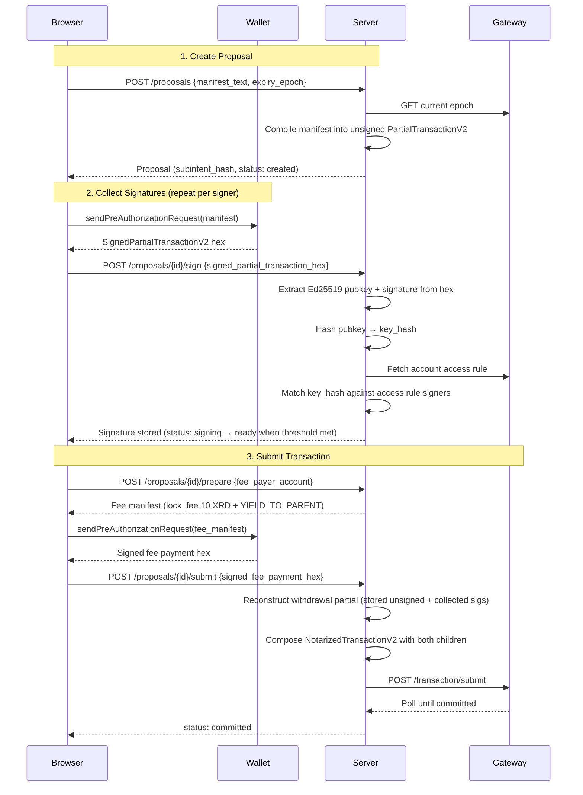

# Multisig Orchestrator

Radix DLT multisig transaction orchestrator — propose, collect signatures, and submit multi-party transactions on Babylon Stokenet.

## Prerequisites

- Docker & Docker Compose
- Rust (2021 edition) + Cargo
- Node.js + pnpm

## Quick Start

```bash
./dev.sh
```

This starts PostgreSQL, the backend, and the frontend in one command.

## Architecture

### How It Works

The server builds transaction subintents from user-provided manifests, and each signer approves via wallet pre-authorization. The server collects signatures, validates them against the account's on-ledger access rule, and — once the threshold is met — assembles a `NotarizedTransactionV2` with a fee-payment child and a withdrawal child, then submits it to the Radix Gateway.

### Signing Flow



### Transaction Structure

The final `NotarizedTransactionV2` contains two child subintents:

| Child | Manifest | Signed by |
|---|---|---|
| `fee_payment` | `lock_fee("10") → YIELD_TO_PARENT` | Fee payer (at submit time) |
| `withdrawal` | User's proposal manifest → `YIELD_TO_PARENT` | Multisig signers (collected during signing phase) |

The parent transaction manifest simply yields to each child in order:

```
YIELD_TO_CHILD("fee_payment");
YIELD_TO_CHILD("withdrawal");
```

A server-generated ephemeral Ed25519 key notarizes the transaction (`notary_is_signatory: false` — it controls nothing and exists only to satisfy the `TransactionV2` protocol requirement).

## Manual Start

### 1. Database (PostgreSQL)

```bash
docker compose up -d
```

Starts PostgreSQL 17 on port 5432. Credentials: `postgres/postgres`, database: `multisig_orchestrator`.

### 2. Backend (Rust/Axum)

```bash
cd multisig-server
cp .env.example .env   # first time only
cargo run
```

Runs on http://localhost:3001. Auto-applies database migrations on startup.

### 3. Frontend (React/TanStack Start)

```bash
cd multisig-app
pnpm install             # first time only
pnpm run dev
```

Runs on http://localhost:3000.

## Development

This project uses [pnpm](https://pnpm.io/) as the package manager with a workspace setup.

```bash
pnpm install              # install all dependencies
pnpm fmt                  # format all files (oxfmt)
pnpm fmt:check            # check formatting without writing
pnpm lint                 # lint JS/TS files (oxlint)
```

Pre-commit hooks (via Husky + lint-staged) automatically format and lint staged files.

## Shutdown

```bash
docker compose down     # stop PostgreSQL
```

`./dev.sh` handles graceful shutdown of all services on Ctrl+C.
